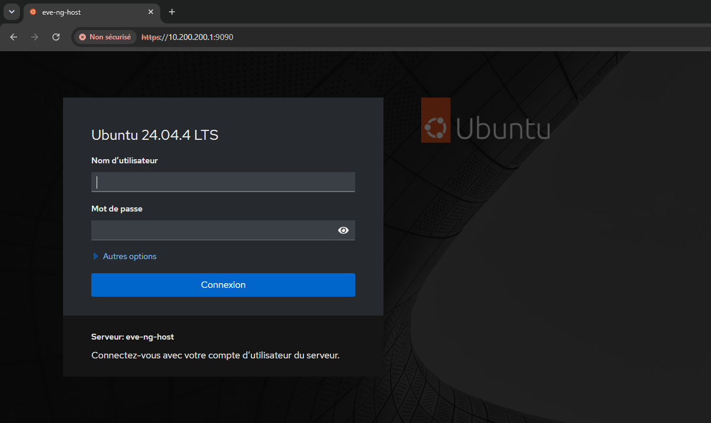
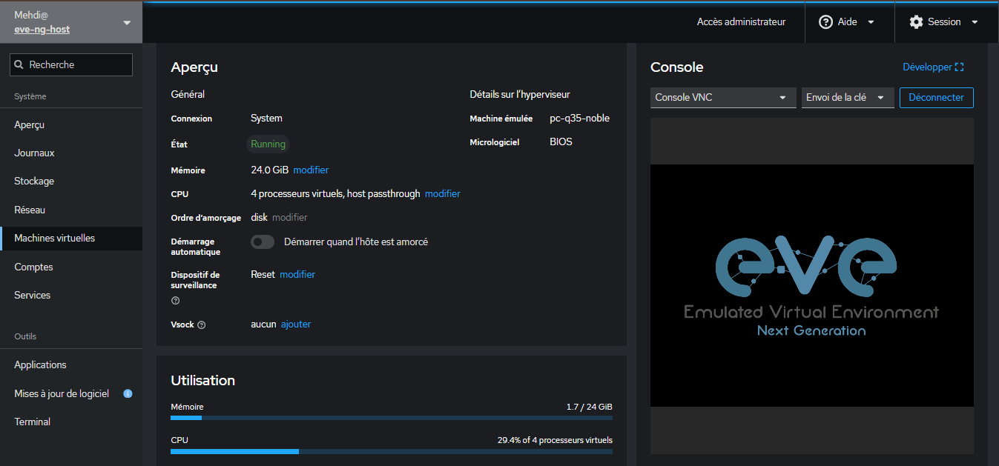
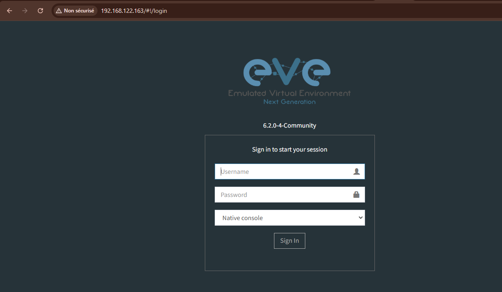
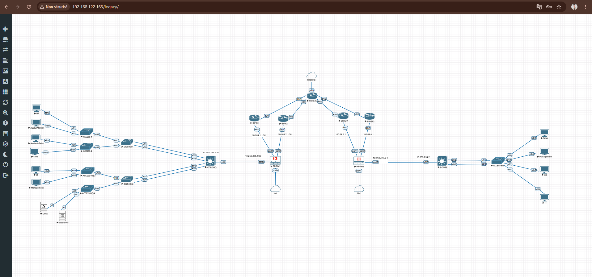

# QEMU/KVM, Cockpit and EVE-NG Deployment

## 1. Overview

The Azure Ubuntu Server was configured as the virtualization host for the EVE-NG network laboratory.

The virtualization stack used in this project is:

```text
Azure VM
   │
   ├── Ubuntu Server 22.04 LTS
   │
   ├── KVM / QEMU
   │
   ├── libvirt
   │
   └── Cockpit
          │
          └── EVE-NG VM
```

The EVE-NG VM hosts the network simulation environment used for the project.

---

## 2. Install QEMU/KVM and libvirt

Update the Ubuntu package repositories:

```bash
sudo apt update
```

Install the virtualization packages:

```bash
sudo apt install -y qemu-kvm libvirt-daemon-system libvirt-clients bridge-utils
```

Enable and start libvirt:

```bash
sudo systemctl enable --now libvirtd
```

Add the current user to the required groups:

```bash
sudo usermod -aG libvirt $USER
sudo usermod -aG kvm $USER
```

After adding the user to the groups, log out and log back in.

Verify the groups:

```bash
groups
```

The default libvirt network was used for the EVE-NG VM.

```text
Network: 192.168.122.0/24
Bridge:  virbr0
```

---

## 3. Install Cockpit

Cockpit was installed as the web-based management interface for the virtualization host.

```bash
sudo apt install -y cockpit
```

Enable and start Cockpit:

```bash
sudo systemctl enable --now cockpit.socket
```

Verify the service:

```bash
sudo systemctl status cockpit.socket
```

Cockpit uses TCP port `9090`.

The management interface is available at:

```text
https://<AZURE_PUBLIC_IP>:9090
```

The Azure NSG allows TCP port `9090` for Cockpit access.

### Screenshot



**Figure 1 – Cockpit dashboard**

---

## 4. Install Cockpit Machines

To manage KVM/libvirt virtual machines from Cockpit:

```bash
sudo apt install -y cockpit-machines
```

The **Virtual Machines** section then becomes available in Cockpit.

It provides graphical management of:

* Virtual machines
* CPU and memory
* Virtual disks
* Network interfaces
* VM console
* VM power state

---

# 5. Deploy the EVE-NG Virtual Machine

An **EVE-NG Community Edition 6.2.0-4** virtual machine was deployed using Cockpit.

The official EVE-NG Full ISO was used:

[EVE-NG CE 6.2.0-4 Full ISO](https://customers.eve-ng.net/eve-ce-prod-6.2.0-4-full.iso?utm)

The Full ISO contains a customized, pre-packaged Ubuntu Server environment together with EVE-NG and its required components.

Therefore, Ubuntu does not need to be installed separately inside the EVE-NG VM.

```text
EVE-NG Full ISO
       │
       ▼
Customized Ubuntu + EVE-NG
       │
       ▼
EVE-NG Virtual Machine
```

---

## 6. EVE-NG VM Configuration

The VM was created through:

```text
Cockpit → Virtual Machines → Create VM
```

The configuration used for the project was:

| Component     | Configuration     |
| ------------- | ----------------- |
| OS            | EVE-NG CE 6.2.0-4 |
| vCPU          | 4                 |
| CPU Mode      | Host Passthrough  |
| RAM           | 24 GB             |
| Firmware      | BIOS              |
| Disk Capacity | 300 GB            |
| Disk Format   | QCOW2             |
| Disk Bus      | VirtIO            |
| Network Model | VirtIO            |
| Network       | libvirt `default` |

### Screenshot



**Figure 2 – EVE-NG virtual machine configuration in Cockpit**

---

## 7. EVE-NG Installation

The installation process was:

1. Download the EVE-NG Full ISO.
2. Create the VM in Cockpit.
3. Allocate **24 GB RAM** and **4 vCPUs**.
4. Set CPU mode to **Host Passthrough**.
5. Select **BIOS** firmware.
6. Create a **300 GB QCOW2** disk using the VirtIO bus.
7. Attach the EVE-NG Full ISO.
8. Connect the VM to the libvirt `default` network.
9. Start the VM and boot from the ISO.
10. Complete the EVE-NG installation.
11. Reboot the VM.
12. Disconnect the installation ISO.
13. Boot the VM from the installed QCOW2 disk.

---

## 8. EVE-NG Storage

The EVE-NG virtual disk is stored on the Ubuntu host under:

```text
/var/lib/libvirt/images/
```

Disk image:

```text
ubuntu22.04-2026-7-8.qcow2
```

Configuration:

| Property           | Value    |
| ------------------ | -------- |
| Capacity           | 300 GB   |
| Format             | QCOW2    |
| Bus                | VirtIO   |
| Storage            | File     |


The **300 GB** represents the virtual capacity available.

---

## 9. EVE-NG Network Configuration

The EVE-NG VM uses the libvirt `default` network with a VirtIO interface.

| Property    | Value                |
| ----------- | -------------------- |
| Interface   | VirtIO               |
| MAC Address | `52:54:00:15:95:e1`  |
| IP Address  | `192.168.122.163/24` |
| Network     | `default`            |
| TAP Device  | `vnet0`              |

Network structure:

```text
EVE-NG VM
    │
    │ VirtIO
    ▼
  vnet0
    │
    ▼
  virbr0
    │
    ▼
192.168.122.0/24
```

The EVE-NG management IP is:

```text
192.168.122.163/24
```

This is a private IP address. Remote access to the private EVE-NG environment is provided through the WireGuard VPN documented in:

```text
deployment/03-wireguard.md
```

---

## 10. Verify the Virtual Machine

The VM can be verified from the Ubuntu host using `virsh`.

List virtual machines:

```bash
sudo virsh list --all
```

Display VM information:

```bash
sudo virsh dominfo <VM_NAME>
```

Display network interfaces:

```bash
sudo virsh domiflist <VM_NAME>
```

Example:

```text
Interface   Type      Source    Model    MAC
---------------------------------------------------------
vnet0       network   default   virtio   52:54:00:15:95:e1
```

The VM can also be managed directly from:

```text
Cockpit → Virtual Machines → EVE-NG
```

---

# 11. EVE-NG Login

After completing the installation, the EVE-NG management interface became available through the VM's private network address.

```text
192.168.122.163
```

### Screenshot



**Figure 3 – EVE-NG Community Edition login interface**

---

# 12. EVE-NG Dashboard

After authentication, the EVE-NG dashboard provides access to the network simulation environment used for the project.

### Screenshot



**Figure 4 – EVE-NG network simulation dashboard**

---

## Deployment Result

```text
Microsoft Azure
      │
      ▼
Ubuntu Server 22.04
      │
      ▼
KVM / QEMU + libvirt
      │
      ▼
Cockpit
      │
      ▼
EVE-NG VM
      │
      ├── 4 vCPU
      ├── 24 GB RAM
      ├── Host Passthrough
      ├── BIOS
      ├── 300 GB QCOW2
      └── 192.168.122.163/24
             │
             ▼
        EVE-NG Dashboard
```

The EVE-NG environment is now accessible through a secure WireGuard VPN connection.

The next stage is documented in:

```text
deployment/03-wireguard.md
```

This stage covers the configuration of:

* WireGuard VPN server
* WireGuard client
* Private VPN network
* IP forwarding and NAT
* Access to the private EVE-NG network
* Secure remote connectivity to EVE-NG

