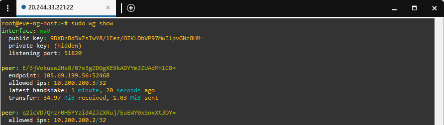
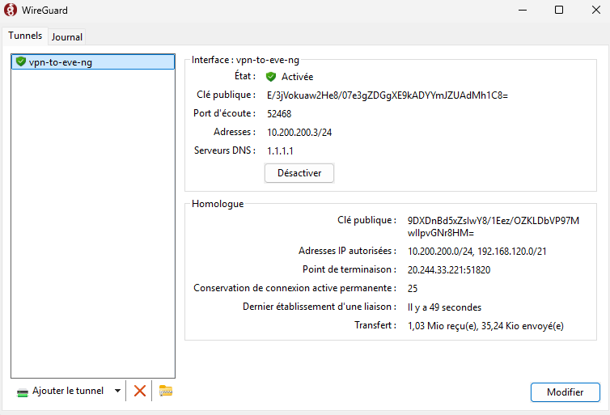
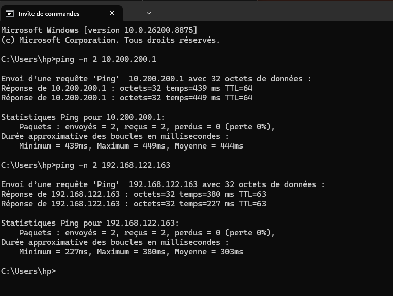

# WireGuard VPN Deployment

WireGuard was deployed on the Ubuntu virtualization host to provide secure remote access to the EVE-NG virtual machine.

The EVE-NG VM is connected to the private libvirt network and uses the following management address:

```text
192.168.122.163/24
```

Because the EVE-NG VM uses a private IP address, a WireGuard VPN was configured to allow secure access from the administrator's workstation.

The VPN provides a secure communication path between the administrator's workstation, the Ubuntu virtualization host, and the private EVE-NG network.

---

# 1. Network Architecture

The resulting access path is:

```text
Administrator Workstation
        │
        │ WireGuard VPN
        │
        ▼
10.200.200.1
Ubuntu Azure Host
        │
        │ NAT / Forwarding
        ▼
     virbr0
192.168.122.0/24
        │
        ▼
192.168.122.163
EVE-NG VM
```

The networks used in the deployment are:

| Network / Address  | Purpose                 |
| ------------------ | ----------------------- |
| `10.200.200.0/24`  | WireGuard VPN network   |
| `10.200.200.1`     | WireGuard server        |
| `10.200.200.2`     | WireGuard client        |
| `192.168.122.0/24` | libvirt default network |
| `192.168.122.163`  | EVE-NG management IP    |
| `virbr0`           | libvirt virtual bridge  |

The WireGuard VPN allows the administrator to access the private EVE-NG network without exposing the EVE-NG management interface directly to the Internet.

---

# 2. Install WireGuard

WireGuard was installed on the Ubuntu virtualization host.

First, update the package repository:

```bash
sudo apt update
```

Install WireGuard:

```bash
sudo apt install -y wireguard
```

Verify the installation:

```bash
wg --version
```

The WireGuard server configuration is stored at:

```text
/etc/wireguard/wg0.conf
```

The VPN interface used by the server is:

```text
wg0
```

---

# 3. Generate WireGuard Keys

WireGuard uses public-key cryptography to establish secure VPN tunnels.

The deployment uses two key pairs:

```text
Server
├── Server Private Key
└── Server Public Key

Client
├── Client Private Key
└── Client Public Key
```

Each device keeps its own private key.

The public keys are exchanged between the server and client.

Private keys must never be exposed publicly.

---

## 3.1 Generate the Server Key Pair

On the Ubuntu virtualization host, create the WireGuard directory:

```bash
sudo mkdir -p /etc/wireguard
cd /etc/wireguard
```

Generate the server private and public keys:

```bash
sudo wg genkey | sudo tee server_private.key | sudo wg pubkey | sudo tee server_public.key
```

Display the server private key:

```bash
sudo cat server_private.key
```

Display the server public key:

```bash
sudo cat server_public.key
```

The generated keys will have the following format:

```text
Server Private Key: eA8fG6hI4jK2lM0nP8qR6sT4uV2wX0yZ2aBcDeFgHiJ=

Server Public Key: K9jHgFdSaBcDeFgHiJkLmNoPqRsTuVwXyZ1vU8tR3qP=
```

The actual private key must remain confidential.

---

# 4. Generate the Client Key Pair

On the administrator's workstation, generate the client keys:

```bash
wg genkey | tee client_private.key | wg pubkey > client_public.key
```

Display the client private key:

```bash
cat client_private.key
```

Display the client public key:

```bash
cat client_public.key
```

The client uses the following VPN address:

```text
10.200.200.2/24
```

The client public key is added to the WireGuard server configuration.

---

# 5. Example WireGuard Key Pairs

The following keys are **fictional example values** included only to demonstrate the format of WireGuard key pairs.

> **Security notice:** The keys below are **not real keys**, are not used by the deployed VPN infrastructure.

## 5.1 Example Pair 1 — Server

```text
Private Key:
eA8fG6hI4jK2lM0nP8qR6sT4uV2wX0yZ2aBcDeFgHiJ=

Public Key:
K9jHgFdSaBcDeFgHiJkLmNoPqRsTuVwXyZ1vU8tR3qP=
```

## 5.2 Example Pair 2 — Client

```text
Private Key:
mN3pQ6rStW4yZ8aBcDeFgHiJkLmNoPqRsTuVwXyZ2bC=

Public Key:
X0yZ2aBcDeFgHiJkLmNoPqRsTuVwXyZ2bCdEfGhIjKl=
```

These values are provided only to illustrate how WireGuard private and public keys are represented in a configuration.

In the actual deployment, the server and client use their own securely generated key pairs.

---

# 6. WireGuard Key Relationship

The server and client each have their own private/public key pair.

| Device | Private Key        | Public Key        |
| ------ | ------------------ | ----------------- |
| Server | Server private key | Server public key |
| Client | Client private key | Client public key |

The **server configuration contains the client's public key**.

The **client configuration contains the server's public key**.

The private keys remain only on the devices that own them.

---

# 7. WireGuard Server Configuration

The WireGuard server configuration is stored at:

```text
/etc/wireguard/wg0.conf
```

The sanitized configuration used for this project is:

```ini
[Interface]
Address = 10.200.200.1/24
ListenPort = 51820
PrivateKey = <SERVER_PRIVATE_KEY>

PostUp = iptables -A FORWARD -i wg0 -j ACCEPT
PostUp = iptables -A FORWARD -o wg0 -j ACCEPT
PostUp = iptables -A FORWARD -i wg0 -o virbr0 -j ACCEPT
PostUp = iptables -A FORWARD -i virbr0 -o wg0 -j ACCEPT
PostUp = iptables -t nat -A POSTROUTING -s 10.200.200.0/24 -o virbr0 -j MASQUERADE

PostDown = iptables -D FORWARD -i wg0 -j ACCEPT
PostDown = iptables -D FORWARD -o wg0 -j ACCEPT
PostDown = iptables -D FORWARD -i wg0 -o virbr0 -j ACCEPT
PostDown = iptables -D FORWARD -i virbr0 -o wg0 -j ACCEPT
PostDown = iptables -t nat -D POSTROUTING -s 10.200.200.0/24 -o virbr0 -j MASQUERADE

[Peer]
PublicKey = <CLIENT_PUBLIC_KEY>
AllowedIPs = 10.200.200.2/32
```

The actual private key is represented by:

```text
<SERVER_PRIVATE_KEY>
```

in the GitHub documentation.

The client's public key is represented by:

```text
<CLIENT_PUBLIC_KEY>
```

---

# 8. WireGuard Client Configuration

The WireGuard client configuration contains the client's private key and the server's public key.

The client configuration is:

```ini
[Interface]
PrivateKey = <CLIENT_PRIVATE_KEY>
Address = 10.200.200.2/24

[Peer]
PublicKey = <SERVER_PUBLIC_KEY>
Endpoint = <AZURE_PUBLIC_IP>:51820
AllowedIPs = 10.200.200.0/24, 192.168.122.0/24
PersistentKeepalive = 25
```

The client uses:

```text
10.200.200.2/24
```

The WireGuard server uses:

```text
10.200.200.1/24
```

The `AllowedIPs` configuration allows the client to reach:

```text
10.200.200.0/24
192.168.122.0/24
```

The second network is the private libvirt network containing the EVE-NG VM.

---

# 9. Configure Forwarding Between WireGuard and libvirt

The Ubuntu virtualization host acts as a router between the WireGuard VPN and the libvirt network.

The WireGuard interface is:

```text
wg0
```

The libvirt bridge is:

```text
virbr0
```

Traffic forwarding from WireGuard is enabled with:

```bash
iptables -A FORWARD -i wg0 -j ACCEPT
iptables -A FORWARD -o wg0 -j ACCEPT
```

Specific forwarding rules are configured between WireGuard and the libvirt bridge:

```bash
iptables -A FORWARD -i wg0 -o virbr0 -j ACCEPT
iptables -A FORWARD -i virbr0 -o wg0 -j ACCEPT
```

The resulting path is:

```text
WireGuard Client
10.200.200.2
       │
       ▼
      wg0
       │
       ▼
 Ubuntu Host
10.200.200.1
       │
       ▼
    virbr0
       │
       ▼
192.168.122.0/24
       │
       ▼
    EVE-NG
192.168.122.163
```

---

# 10. Configure NAT

The WireGuard network and libvirt network use different private address ranges.

WireGuard:

```text
10.200.200.0/24
```

libvirt:

```text
192.168.122.0/24
```

NAT is configured on the Ubuntu virtualization host so that traffic from the WireGuard client can reach the libvirt network.

The following rule performs masquerading:

```bash
iptables -t nat -A POSTROUTING \
    -s 10.200.200.0/24 \
    -o virbr0 \
    -j MASQUERADE
```

This allows the WireGuard client to communicate with the EVE-NG VM.

---

# 11. Enable IPv4 Forwarding

IPv4 forwarding is required because the Ubuntu host routes traffic between the WireGuard and libvirt networks.

Check the current configuration:

```bash
sudo sysctl net.ipv4.ip_forward
```

Enable IPv4 forwarding:

```bash
sudo sysctl -w net.ipv4.ip_forward=1
```

To make the configuration persistent, edit:

```bash
sudo nano /etc/sysctl.conf
```

Add:

```text
net.ipv4.ip_forward=1
```

Apply the configuration:

```bash
sudo sysctl -p
```

Verify:

```bash
sudo sysctl net.ipv4.ip_forward
```

Expected result:

```text
net.ipv4.ip_forward = 1
```

---

# 12. Start WireGuard

Start the WireGuard interface:

```bash
sudo wg-quick up wg0
```

Verify the interface:

```bash
ip addr show wg0
```

Check the WireGuard status:

```bash
sudo wg show
```

To stop the VPN:

```bash
sudo wg-quick down wg0
```

---

# 13. Enable WireGuard at Boot

To automatically start WireGuard when the Ubuntu server boots:

```bash
sudo systemctl enable wg-quick@wg0
```

Start the service:

```bash
sudo systemctl start wg-quick@wg0
```

Check the service status:

```bash
sudo systemctl status wg-quick@wg0
```

---

# 14. VPN Verification

After completing the configuration, the VPN was tested from the administrator workstation.

The tests verify:

1. WireGuard peer connectivity
2. Client VPN configuration
3. Connectivity to the VPN server
4. Connectivity to the private EVE-NG network
5. Access to the EVE-NG management interface

---

## 14.1 WireGuard Peer Status

The WireGuard server status was verified using:

```bash
sudo wg show
```

The command displays the WireGuard interface, configured peer, allowed IP address, latest handshake information, and transferred traffic.

### Screenshot



**Figure 1 – WireGuard server showing the configured client and tunnel status**

---

## 14.2 WireGuard Client Configuration

The WireGuard client was configured on the administrator's workstation.

The client uses the VPN address:

```text
10.200.200.2/24
```

The client configuration contains the server public key and the required routes to access the WireGuard and EVE-NG private networks.

### Screenshot



**Figure 2 – WireGuard client configuration and active VPN tunnel**

---

## 14.3 VPN Connectivity Test

After activating the WireGuard tunnel, connectivity was tested from the administrator workstation.

First, the WireGuard server was tested:

```powershell
ping 10.200.200.1
```

Then, the EVE-NG private address was tested:

```powershell
ping 192.168.122.163
```

Successful responses confirm that traffic can travel through the WireGuard tunnel and reach the private EVE-NG network.

### Screenshot



**Figure 3 – Connectivity test from the WireGuard client to the VPN server and EVE-NG network**

---

## 14.4 Access EVE-NG Through the Private IP

After establishing the WireGuard VPN connection, the EVE-NG management interface was accessed using its private IP address:

```text
https://192.168.122.163
```

This confirms that the EVE-NG management interface can be accessed through the private VPN connection without requiring direct public exposure.

### Screenshot


**Figure 4 – EVE-NG management interface accessed through the private VPN network**

---

# 15. Complete VPN Access Flow

The complete management path is:

```text
                         INTERNET
                            │
                            │ UDP 51820
                            ▼
                 ┌─────────────────────┐
                 │    WireGuard VPN    │
                 │                     │
                 │  10.200.200.0/24    │
                 └──────────┬──────────┘
                            │
                            ▼
                 ┌─────────────────────┐
                 │    Azure Ubuntu     │
                 │                     │
                 │ wg0                 │
                 │ 10.200.200.1/24     │
                 │                     │
                 │ NAT + Forwarding    │
                 └──────────┬──────────┘
                            │
                            ▼
                         virbr0
                            │
                            ▼
                 ┌─────────────────────┐
                 │   libvirt Network   │
                 │ 192.168.122.0/24    │
                 └──────────┬──────────┘
                            │
                            ▼
                 ┌─────────────────────┐
                 │      EVE-NG VM      │
                 │                     │
                 │ 192.168.122.163     │
                 └─────────────────────┘
```

The WireGuard VPN therefore provides a secure management path from the administrator's workstation to the private EVE-NG environment.

---

# 16. Security Considerations

Private cryptographic keys must never be exposed in a public GitHub repository.

The following information must remain confidential:

* Server private key
* Client private key
* Production WireGuard configuration containing private keys
* Sensitive infrastructure credentials

The key values shown in this documentation are **fake/example values created solely for demonstration purposes**.

They are **not the keys used by the actual WireGuard deployment** and must **not** be used for production purposes.

The example values are:

```text
Server Private Key:
eA8fG6hI4jK2lM0nP8qR6sT4uV2wX0yZ2aBcDeFgHiJ=

Server Public Key:
K9jHgFdSaBcDeFgHiJkLmNoPqRsTuVwXyZ1vU8tR3qP=

Client Private Key:
mN3pQ6rStW4yZ8aBcDeFgHiJkLmNoPqRsTuVwXyZ2bC=

Client Public Key:
X0yZ2aBcDeFgHiJkLmNoPqRsTuVwXyZ2bCdEfGhIjKl=
```

These values are included only to demonstrate how WireGuard keys look in a configuration.

The actual server and client private keys remain securely stored on their respective devices and are not committed to the GitHub repository.

The actual server configuration remains on the Ubuntu virtualization host:

```text
/etc/wireguard/wg0.conf
```

The GitHub repository contains only the documentation, sanitized configuration examples, and fictional demonstration keys.

---

The WireGuard deployment therefore forms the final secure-access layer of the virtualization environment, allowing the administrator to remotely access EVE-NG through its private IP address.
