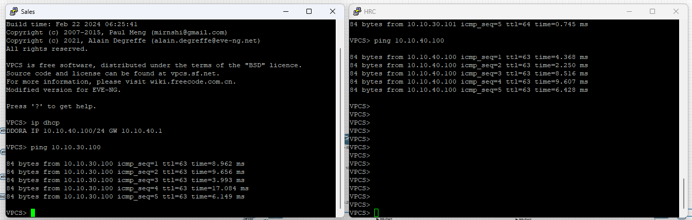

# Inter-VLAN Routing Test

## Objective

Verify that devices located in different VLANs can communicate successfully through the Cisco Layer 3 Core Switch using Inter-VLAN routing.

## Test Scenario

* Source Device: **PC-HR**
* Source VLAN: **VLAN 30 (HR Department)**
* Destination Device: **PC-Sales**
* Destination VLAN: **VLAN 40 (Sales Department)**

## Procedure

1. Verify that the VLAN interfaces (SVIs) are operational on the Core Layer 3 Switch.
2. Confirm that both hosts use the correct default gateway.
3. From **PC-HR**, execute an ICMP ping to **PC-Sales**.
4. Observe the connectivity results.

## Expected Result

* Communication between different VLANs is successful.
* The Core Layer 3 Switch routes the traffic correctly.
* Packet loss equals **0%**.

## Test Result

**Status:** ✅ Passed

The successful communication between VLAN 30 and VLAN 20 confirms that Inter-VLAN routing is correctly configured on the Cisco Layer 3 Core Switch and that routing between departmental networks is fully operational.

## Evidence

*Figure 2 – Successful ICMP communication between hosts located in different VLANs through the Core Layer 3 Switch.*
