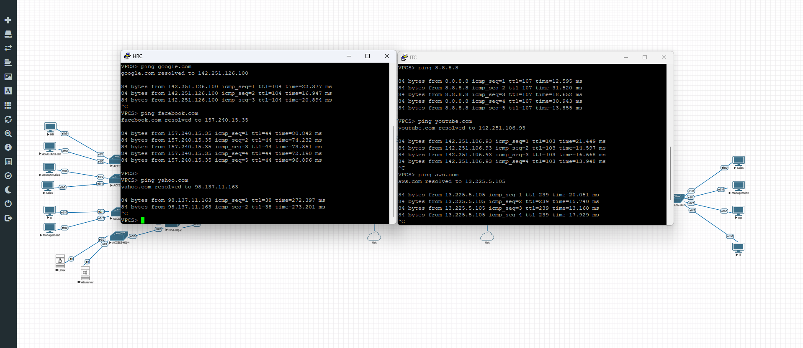

# Internet Access Test

## Objective

Verify that workstations located at both Headquarters and the Branch Office can successfully access public Internet resources through the FortiGate SD-WAN infrastructure.

## Test Scenario

* **Headquarters:** PC-HR (VLAN 30 – Human Resources)
* **Branch Office:** PC-IT (VLAN 20 – IT Department)

The following public websites were tested:

* https://www.google.com
* https://www.facebook.com
* https://www.youtube.com
* https://www.yahoo.com
* https://aws.amazon.com

## Procedure

1. Verify that the FortiGate SD-WAN members are operational.
2. Confirm that Internet connectivity is available at both Headquarters and the Branch Office.
3. From **PC-HR** at Headquarters, access each of the listed public websites.
4. From **PC-IT** at the Branch Office, access the same public websites.
5. Verify that all websites load successfully from both locations.

## Expected Result

* Both workstations have Internet connectivity.
* All tested websites are accessible from Headquarters and the Branch Office.
* Outbound traffic is translated through the FortiGate firewall using NAT.
* Internet traffic is forwarded through the active SD-WAN WAN link.

## Test Result

**Status:** ✅ Passed

Both workstations successfully accessed all tested public websites, confirming that Internet connectivity, NAT, routing, and SD-WAN forwarding are fully operational at both Headquarters and the Branch Office.

## Evidence

*Figure 3 – Successful Internet access from PC-HR (Headquarters) and PC-IT (Branch Office) to multiple public websites through the FortiGate SD-WAN infrastructure.*
