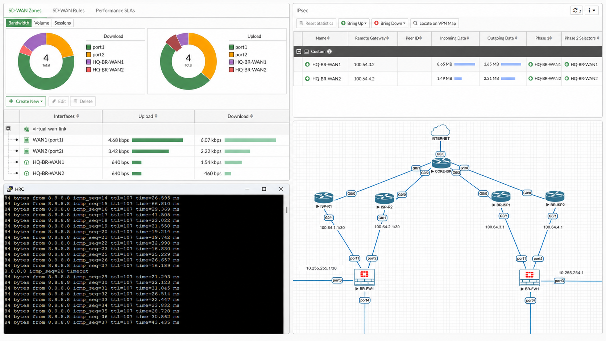

# SD-WAN Automatic Failover Test

## Objective

Validate the high-availability mechanism of the FortiGate SD-WAN solution by demonstrating the automatic failover from the primary Internet Service Provider (ISP1) to the backup Internet Service Provider (ISP2), followed by the automatic recovery once the primary connection is restored.

---

## Test Scenario

**Location:** Headquarters (HQ)

**Infrastructure:**

* Primary WAN: ISP1
* Secondary WAN: ISP2
* FortiGate SD-WAN (Priority Mode)
* Health Check: ICMP (8.8.8.8)

---

## Procedure

1. Verify that both ISP1 and ISP2 are operational.
2. Confirm that SD-WAN is forwarding traffic through ISP1.
3. Start a continuous Internet connectivity test.
4. Disconnect the ISP1 link.
5. Observe the automatic failover to ISP2.
6. Reconnect ISP1.
7. Verify that SD-WAN automatically returns traffic to the primary link.

---

## Expected Result

* ISP1 is selected as the preferred WAN during normal operation.
* Internet connectivity remains available after the failure of ISP1.
* SD-WAN automatically redirects traffic to ISP2.
* Once ISP1 is restored, traffic automatically returns to the primary WAN without manual intervention.

---

## Test Result

**Status:** ✅ Passed

The FortiGate SD-WAN successfully detected the failure of the primary WAN link and redirected all outbound traffic to the backup Internet connection. After restoring ISP1, the firewall automatically resumed forwarding traffic through the preferred WAN interface, confirming the proper operation of the SD-WAN failover and recovery mechanism.

---

## Validation Screenshot

The validation screenshot should contain the following components:

1. **FortiGate SD-WAN Monitor**

   * ISP1: Up (Primary)
   * ISP2: Up (Backup)
   * Health Check: Alive

2. **EVE-NG Topology**

   * Headquarters FortiGate
   * Core ISP
   * Branch FortiGate
   * Both ISP links

3. **Connectivity Test**

   * Continuous ping demonstrating successful Internet connectivity.

4. **IPsec VPN Status**

   * VPN tunnel established and operational.

*Figure 5 – SD-WAN operational status showing active WAN members, enterprise topology, Internet connectivity, and IPsec VPN status.*

---

## Project Demonstration

The complete SD-WAN failover demonstration can be viewed here: https://drive.google.com/file/d/17SUD9Lm-Yk3i3x0_ih3mCALNQOcbUnwO/view
