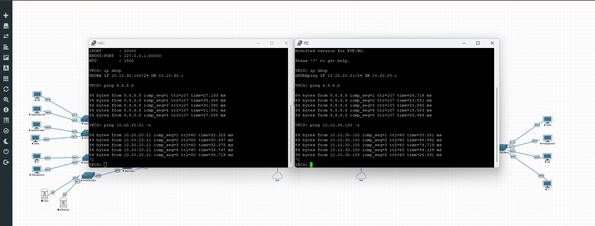

# Site-to-Site IPsec VPN Test

## Objective

Verify secure communication between Headquarters and the Branch Office through the IPsec Site-to-Site VPN tunnel.

## Test Scenario

* **Source Device:** PC-HR (Headquarters – VLAN 30)
* **Destination Device:** PC-IT (Branch Office – VLAN 20)

## Procedure

1. Verify that the IPsec VPN tunnel is established on both FortiGate firewalls.
2. Confirm that the required static routes are present.
3. From **PC-HR** at Headquarters, execute an ICMP ping to **PC-IT** at the Branch Office.
4. Repeat the test from **PC-IT** to **PC-HR**.
5. Verify that communication is successful in both directions.

## Expected Result

* The IPsec VPN tunnel remains established.
* Headquarters and Branch devices communicate successfully.
* ICMP replies are received in both directions.
* Packet loss equals **0%**.

## Test Result

**Status:** ✅ Passed

Successful bidirectional communication between Headquarters and the Branch Office confirms that the IPsec Site-to-Site VPN tunnel is operational and that routing between both sites is functioning correctly.

## Evidence

*Figure 4 – Successful ICMP communication between Headquarters and Branch Office through the IPsec Site-to-Site VPN tunnel.*
